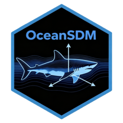

 <!-- README.Rmd is compiled to README.md, which is displayed on GitHub -->
  
  # OceanSDM <a href="https://harryzhang0130.github.io/OceanSDM/"></a>
  
  [](https://github.com/HarryZhang0130/OceanSDM/actions)
[](https://opensource.org/licenses/MIT)

## Installation

You can install the development version of `OceanSDM` from GitHub:
```{r}
if (!require("remotes")) install.packages("remotes")
remotes::install_github("HarryZhang0130/OceanSDM",dependencies = TRUE)
```

## Overview

`OceanSDM` is an R package for building **Species Distribution Models (SDMs)** for marine organisms. It provides a streamlined workflow to:
  
  - Download environmental layers (temperature, salinity, etc.)
- Clean and reduce sampling bias in occurrence records
- Build ensemble SDMs using multiple algorithms
- Map predictions and evaluate model performance
- Generate response curves and variable importance plots
- For detailed tutorials, see "OceanSDM_mannual.pdf".

## Functions

| Category | Functions |
  |----------|-----------|
  | Data preparation | 'ob_data()', 'correct_ob()','bias_check()', 'bias_reduce()','range_check_single', 'range_check()' |
  | Environmental data | 'env_download()','benthic_layer', 'env_bin()' |
  | Modeling | 'TB_sdm()', 'TB_map()', 'TB_rescur()', 'TB_varimp()' |
  | Niche estimation | 'niche_occ()', 'niche_tag()'|
  | Estimating and visualizing TD & PD | 'clim_bin()' ,'TB_depth()','plot_stat_4D()' |
  
## Contributing
  
  Contributions are welcome! Please report issues or suggest improvements via [GitHub Issues](https://github.com/HarryZhang0130/OceanSDM/issues).

## License

This package is licensed under the [MIT License](LICENSE.md).  
© Harry Zhang
